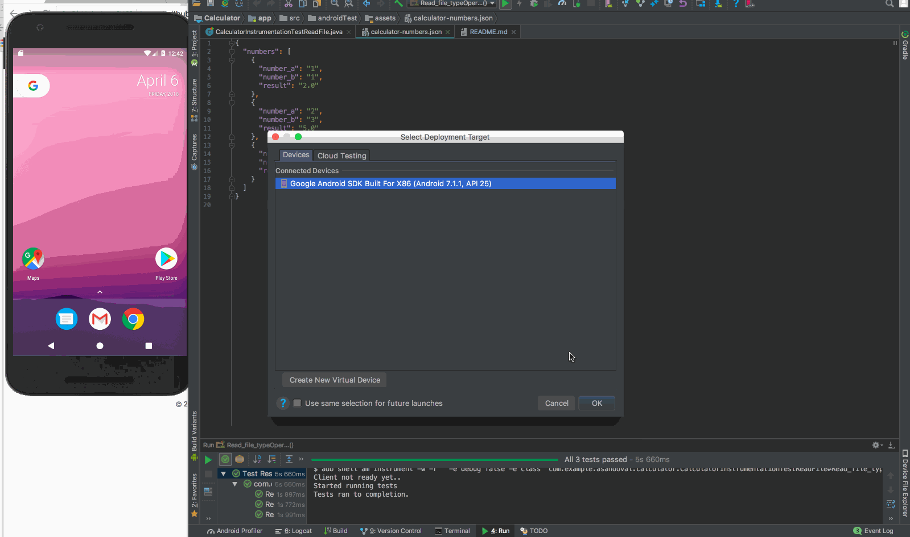

# Android Parameterized Test (parse Json file)

With **Parameterized testing** we can execute the same test over and over again using different values

 * Test parses Json file calculator-numbers.json to get inputs to add and the expected result.
 * Using Parameterize testing we can repeat same test many times for all the inputs from the json file.
 * This is a very simple example to give an idea of Parameterized testing.
 * At work we used Parameterized testing to perform a test that needs to repeat many times depending on input.

## How to run:
1. Git pll repo
2. Open with Android Studio 3.+
3. Connect Android device
4. Right click and run CalculatorInstrumentationTestReadFile.java or run gradle command `./gradlew connectedGoogleFlavorTuneinFreeArmv7aDebugAndroidTest`

## Test steps:
1. Parses Json file to get values to add and also the result, A + B = result
2. We pass the values to below operation.
        ```performOperation(R.id.operation_add_btn, sNumberA, sNumberB, sResult);```
3. Adds all values and checks result

## Demo:



[Parameterized Test class here](https://github.com/AndreSand/AndroidJsonFileParameterizedTest/blob/master/app/src/androidTest/java/com/example/asandoval/calculator/CalculatorInstrumentationTestReadFile.java)

### Note:

To be able to parse json file you need to create new folder **/assets** inside `src/androidTest/`

Right click on `androidTest` folder -> New -> Folder -> Assets Folder -> choose correct location `.../src/androidTest/`

### Resources:

[Google's test repo](https://github.com/googlesamples/android-testing/tree/master/runner/AndroidJunitRunnerSample)

Let me know if you have a question thanks.
-Andres

